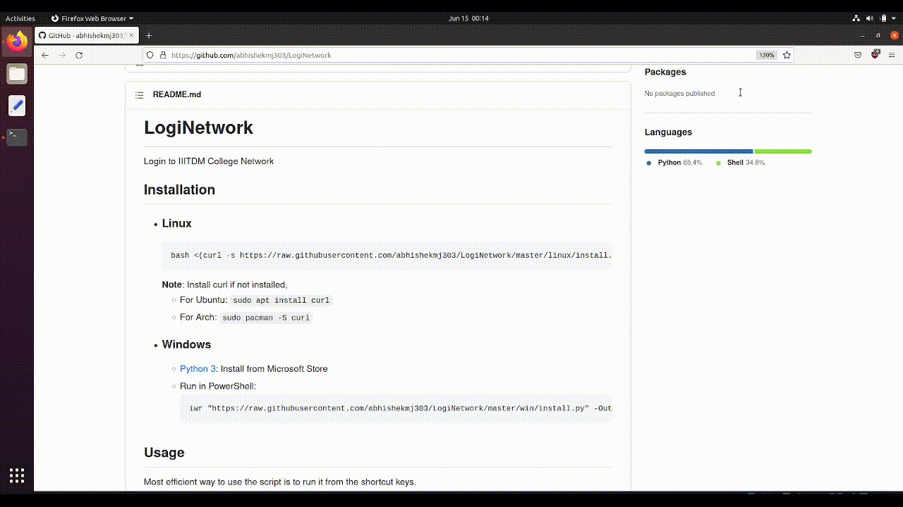

# LogiNetwork

Automatically login to IIITDM College LAN/WiFi

## Installation

- ### Linux

  

  ```
  bash <(curl -s https://raw.githubusercontent.com/abhishekmj303/LogiNetwork/master/linux/install.sh)
  ```

  **Note**: Install curl if not installed,

  - For Ubuntu: `sudo apt install curl`
  - For Arch: `sudo pacman -S curl`

- ### Windows
  
  - [Python 3](https://apps.microsoft.com/store/detail/python-310/9PJPW5LDXLZ5): Install from Microsoft Store (If not installed already)
  - Run in PowerShell:
    ```
    iwr "https://raw.githubusercontent.com/abhishekmj303/LogiNetwork/master/win/install.py" -OutFile "install.py"; python .\install.py; rm .\install.py
    ```

## Usage

No need to do anything after installation. The program automatically detects the network and logs in. (**Beta**)

Another way to use the script is to run it from the shortcut keys. (When the automatic detection fails)

Default Hotkey is " **Ctrl+Alt+e** ". To change the hotkey,

- ### Linux:

  The program is installed in `/opt/LogiNetwork`.

  1. Edit `/opt/LogiNetwork/hotkey.py`
  2. Restart service: `systemctl --user restart loginet.service`

  **Disable**: Stop and Disable service (`stop` and `disable` in place of `restart` above)

  **Uninstall**: `bash /opt/LogiNetwork/uninstall.sh`

- ### Windows:

  The program is installed in `C:\Users\[username]\LogiNetwork`.

  1. Press " **Win+R** " and type " **shell:startup** "
  2. Edit `loginet_bg.pyw`
  3. Run `taskkill /im pythonw.exe /im pythonw3.10.exe /f` and double click `loginet_bg.pyw`

  **Disable**: Kill task and Remove `hotkey.pyw` from startup folder

  **Uninstall**: `python C:\Users\[username]\LogiNetwork\uninstall.py`
